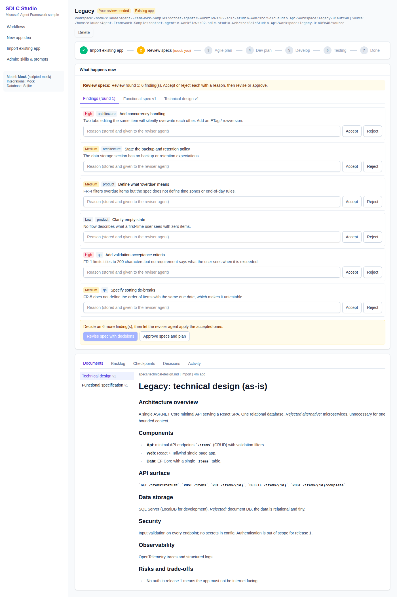
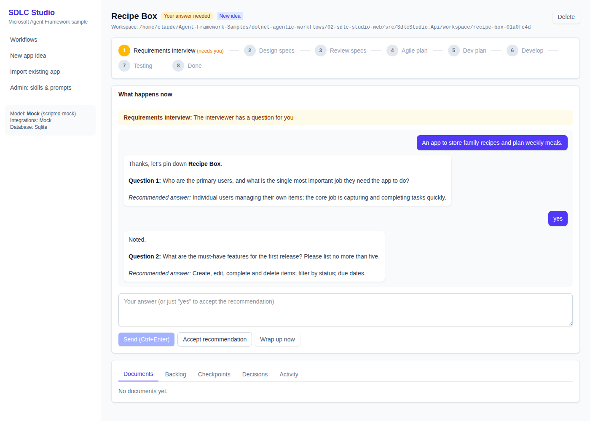
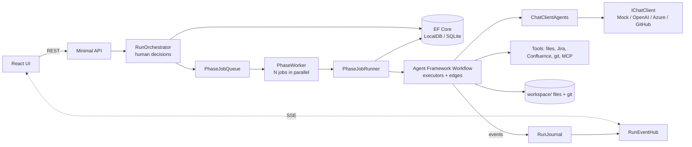

# 02 · SDLC Studio (ASP.NET Core + React)

A web app that takes an idea (or an existing code base) all the way through a software delivery
lifecycle with **many small agents orchestrated by Microsoft Agent Framework workflows**, and a human
approving every step.

```
Requirements interview ─▶ Design specs ─▶ Review specs ⟲ revise ─▶ Agile plan ─▶ Dev plan ─▶ Develop (commit + MR per story) ─▶ Testing ─▶ Done
        ▲ "grill me" agent                 3 reviewers in parallel     validator loop                developer ⟷ reviewer loop
Import existing app ─────────▶ (specs reverse-engineered from code, then the same loop)
```

- **.NET 10 / C# 14** minimal API, **EF Core** on **SQL Server LocalDB** (SQLite option for macOS/Linux), no auth.
- **React 19 + Tailwind v4 + Vite**, built with **pnpm**, with a workflow screen that guides the user.
- Runs **fully offline by default**: a scripted mock `IChatClient` sits under the real Agent Framework, so
  tool calls, structured output, loops and fan-out all execute without an API key.
- Heavily commented: every file explains *why* it is written that way and which alternatives exist.

| Workflow screen (review phase) | Requirements interview |
| --- | --- |
|  |  |

## Quick start

Prerequisites: .NET 10 SDK, Node 20+ with pnpm, git (optional, used for the commit/MR checkpoints).

```bash
# 1. API (http://localhost:5180). Windows: uses LocalDB out of the box.
cd src/SdlcStudio.Api
dotnet run

#    macOS / Linux (no LocalDB): use SQLite instead
Database__Provider=Sqlite dotnet run

# 2. UI (http://localhost:5173, proxies /api to the API)
cd src/SdlcStudio.Web
pnpm install
pnpm dev
```

Single process instead: `pnpm build:api` copies the built UI into the API's `wwwroot`, then `dotnet run`
serves everything on http://localhost:5180.

Generated output (specs, plans, a git repo of generated code, tester prompts) lands in
`src/SdlcStudio.Api/workspace/<run>/`. The OpenAPI document is at `/openapi/v1.json`.

### Using a real model

The default `Llm:Provider` is `Mock`. Switch with user-secrets (never commit keys):

```bash
cd src/SdlcStudio.Api
dotnet user-secrets set "Llm:Provider" "OpenAI"          # or AzureOpenAI | GitHubModels
dotnet user-secrets set "Llm:ApiKey"   "<key>"
dotnet user-secrets set "Llm:Model"    "gpt-4.1-mini"
# Azure OpenAI:  Llm:Endpoint = https://<resource>.openai.azure.com/openai/v1/
# GitHub Models: Llm:Endpoint = https://models.github.ai/inference
```

Jira and Confluence calls are mocked too (`Studio:Integrations:Mode = Mock`). Set `Live` plus the
Atlassian URL, email and API token to call the real REST APIs.

## The phases, and which framework feature each one shows

| Phase | Agents | Workflow shape | Look at |
| --- | --- | --- | --- |
| Requirements | `interviewer` ("grill me": one question at a time, with a recommended answer) | Single agent, conversation persisted across HTTP requests with `SerializeSessionAsync` / `DeserializeSessionAsync` | `Orchestration/PhaseJobRunner.cs` (InterviewTurnAsync) |
| Design | `spec-writer` → `architect` | Sequential typed executors, publisher writes files | `Workflows/SpecWorkflows.cs` |
| Import (existing app) | `app-analyst` with `list_files` / `read_file` tools → `architect` (as-is) | Deterministic scanner step, mocked MCP context, tool-calling agent, then **reuses** the design executors | `Workflows/SpecWorkflows.cs`, `Tools/CodebaseTools.cs` |
| Review | `reviewer-product`, `reviewer-architecture`, `reviewer-qa` | **Fan-out / fan-in barrier**, structured output (`RunAsync<ReviewFindings>`), custom events | `Workflows/ReviewWorkflow.cs` |
| Revise | `spec-reviser` | Accepted findings **and the human's reasons** become the prompt | `SpecWorkflows.BuildRevise` |
| Agile plan | `agile-planner` | **Conditional edges + loop**: C# validator rejects oversized stories, a lambda executor feeds the issues back. Creates Jira issues | `Workflows/PlanningWorkflows.cs` |
| Dev plan | `dev-planner` | Per-story loop inside one executor (dynamic count vs static edges, explained) | `PlanningWorkflows.cs` |
| Develop | `developer` (tool: `update_jira_ticket`) ⟷ `code-reviewer` | Two nested loops, multi-handler executor (`ConfigureProtocol`), **workflow state**, routing by message type, git commit per task, MR checkpoint per story | `Workflows/DevelopWorkflow.cs` |
| Testing | `test-designer` | Generates prompts a tester pastes into their own AI assistant; publishes a Confluence page | `Workflows/TestingWorkflow.cs` |

Every human action (approve, reject, accept/reject a finding) is stored **with its reason** next to the AI
output it judged (`PhaseDecision`, `ReviewFinding.DecisionReason`) and is fed back to the agents.

## Where to find each concept

| Concept | File | Notes |
| --- | --- | --- |
| Building agents from admin-managed instructions + skills | `Ai/AgentFactory.cs`, `Ai/PromptLibrary.cs` | Instructions, prompts and skills live in the DB, seeded from `Content/` |
| Swappable model providers / offline mock | `Ai/ChatClientFactory.cs`, `Ai/Mock/*` | Mocking at the `IChatClient` layer keeps the framework real |
| Workflow building blocks and design rationale | `Workflows/WorkflowCommon.cs` (header comment) | Read this first |
| Streaming workflow events to the UI | `WorkflowRunner`, `Orchestration/Infrastructure.cs`, `Endpoints/RunEndpoints.cs` | Custom `WorkflowEvent` → activity log → SSE (`TypedResults.ServerSentEvents`) |
| Function tools | `Tools/CodebaseTools.cs`, `Tools/AtlassianClients.cs` (`JiraTools`) | `AIFunctionFactory.Create` |
| Tooling: plain API calls | `Tools/AtlassianClients.cs` | Deterministic calls vs tools the model may call, and when to pick each |
| MCP | `Tools/GitHubMcpTools.cs` | Real client code commented out, mocked results used |
| RAG | search for `RAG OPPORTUNITY` and `CodebaseTools` remarks | Where retrieval would help and why (not implemented, by design) |
| Human-in-the-loop | `Orchestration/RunOrchestrator.cs` | Explicit state machine; RequestPort + checkpointing alternative explained in `Domain/WorkflowPhase.cs` |
| Background execution, several workflows at once | `Orchestration/Infrastructure.cs` (`PhaseWorker`) | Channel + `Parallel.ForEachAsync`, pending job persisted for restart |
| C# 14 | `Domain/WorkflowPhase.cs` (extension properties), `Data/Entities.cs` + `Ai/ChatClientFactory.cs` (`field`), `Endpoints/*` (extension blocks) | Plus primary constructors, collection expressions, list patterns |

## Architecture



**Why one workflow per phase?** Humans gate every phase, and the gaps last hours or days. Short workflows
plus persisted state are simpler and more robust than one giant suspended workflow, and each phase can be
re-run with feedback. The alternative (one workflow, `RequestPort` for human input, `CheckpointManager`
with a DB-backed checkpoint store) is described in `Domain/WorkflowPhase.cs`.

**Why typed executors instead of `AgentWorkflowBuilder.BuildSequential/Concurrent`?** Those pass chat
history between agents (great for conversations). This pipeline passes artifacts (spec, plan, code change),
so typed messages make every edge self-documenting and let plain C# (validators, git, publishers) sit
between agents. See the header of `Workflows/WorkflowCommon.cs`.

## Project layout

```
02-sdlc-studio-web/
  SdlcStudio.slnx, Directory.Build.props, Directory.Packages.props, global.json
  src/SdlcStudio.Api/
    Content/{instructions,prompts,skills}/   seed markdown for the Admin area
    Ai/            chat client factory, agent factory, prompt library, offline mock
    Workflows/     one file per phase workflow (executors + graph)
    Orchestration/ state machine, job queue, background worker, event hub
    Tools/         codebase tools, Jira/Confluence, git, MR publisher, MCP example
    Data/ Domain/ Endpoints/ Options/
  src/SdlcStudio.Web/   React + Tailwind + Vite (pnpm)
  tests/SdlcStudio.Tests/  end-to-end tests over the real API with the mock model
```

## Tests

```bash
dotnet test SdlcStudio.slnx
```

The end-to-end test walks a new idea through every phase (interview, review with decisions, revision,
validator loop, rejection with feedback, develop with review loop and MR checkpoints, testing, done), plus
an existing-app import using the file tools. LocalDB is Windows only, so the tests run on SQLite and a
separate test checks the model generates a valid SQL Server schema.

## Production notes (deliberately out of scope)

- **No authentication** (as requested). The import-by-path endpoint can read any folder the API can; keep
  the app on localhost or add auth and an allow-list.
- `EnsureCreated` instead of migrations; switch to migrations before you need schema changes.
- In-memory queue and event hub: for several instances use a durable queue and a Redis/SignalR backplane.
- Generated code is written to a local folder and git repo, never pushed anywhere.

## Ideas to extend

- Add an evaluation step (Microsoft.Extensions.AI.Evaluation) that scores specs and stores the score next to
  the human decision, to see whether prompt edits in the Admin area actually help.
- Implement the RAG opportunities: embed the imported code base and your ADRs, expose `search_code`.
- Replace the `PhaseWorker` with checkpointed workflows so a crash mid-phase resumes at the last superstep.
- Wire OpenTelemetry (`.UseOpenTelemetry()` on the chat client, `WithOpenTelemetry()` on workflows) into Aspire.
