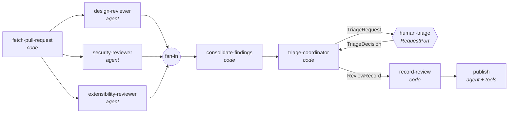

# 03 · MR architecture review

Several small agents review a pull request (merge request) at a **surface level** for **design**,
**security** and **extensibility**, in parallel. A human then accepts or rejects each finding **with a
reason**, and those decisions are stored next to the AI output and fed back into future reviews. A
final agent records the outcome in Jira, on the PR and in a Confluence decision log (dry-run by default).

It is built with the [Microsoft Agent Framework](https://github.com/microsoft/agent-framework) for .NET
(`Microsoft.Agents.AI` + `Microsoft.Agents.AI.Workflows` 1.23), .NET 10 and C# 14, and runs
**fully offline** out of the box. A scripted model stands in for the LLM, so you can step through every
part of the framework without keys.



## Run it

```bash
cd 03-mr-architecture-review/src/MrArchitectureReview

dotnet run                 # bundled sample PR, scripted model, you triage in the console
dotnet run -- --auto       # same, but a simple policy triages (non-interactive)
dotnet run -- --graph      # print the workflow graph as Mermaid

cd ../.. && dotnet test    # 13 tests, including two full end-to-end workflow runs
```

Run it twice. On the second run each reviewer's instructions include a **"Team feedback"** section built
from your first-run decisions. Add `--Logging:LogLevel:MrArchitectureReview.Ai=Debug` to see exactly what
each agent sends to the model (instructions, retrieved guidelines, tool calls).

Output lands in `.review-data/` (git-ignored):

| File | What it is |
|---|---|
| `reviews/<repo>-pr<n>-<run>.json` | Full record: every finding, the prompt hash that produced it, the human verdict, reason, who and when |
| `reviews/<repo>-pr<n>-<run>.md` | The same as a readable report |
| `decisions.jsonl` | Append-only log of every human decision: the feedback-loop memory and an evaluation dataset |

### With a real model and a real PR

```bash
dotnet user-secrets set "Review:Ai:ApiKey" "<key>"     # stored outside the repo

dotnet run -- --provider OpenAI       --model gpt-4.1-mini  --pr https://github.com/<owner>/<repo>/pull/<n>
dotnet run -- --provider GitHubModels --model openai/gpt-4.1-mini --pr ...   # uses a GitHub PAT as the key
dotnet run -- --provider AzureOpenAI  --model <deployment> --Review:Ai:Endpoint=https://<res>.openai.azure.com/openai/v1/ --pr ...
```

For private repositories or to avoid rate limits, also set `Review:GitHub:Token`. The PR head is shallow-cloned
into `.work/` so the agents' tools can read code outside the diff. Jira/Confluence/GitHub writes stay
dry-run until you set `Review:Integrations:DryRun=false` and the Atlassian settings in `appsettings.json`.

## What each framework feature looks like (and where)

Start at [`Orchestration/ReviewWorkflowFactory.cs`](src/MrArchitectureReview/Orchestration/ReviewWorkflowFactory.cs). It declares the whole graph. Every
file has comments explaining **why** it is written that way and **what the alternatives are**.

| Concept | Where | Notes |
|---|---|---|
| **Agents** (`ChatClientAgent`) | [`Orchestration/ReviewerAgentFactory.cs`](src/MrArchitectureReview/Orchestration/ReviewerAgentFactory.cs) | One small agent per aspect, plus a publisher. Instructions are Markdown files in [`Prompts/`](src/MrArchitectureReview/Prompts). |
| **Structured output** | [`Orchestration/Executors/AspectReviewerExecutor.cs`](src/MrArchitectureReview/Orchestration/Executors/AspectReviewerExecutor.cs) | `agent.RunAsync<AspectFindings>()` returns typed findings, no parsing of prose. |
| **Workflow graph** | [`Orchestration/ReviewWorkflowFactory.cs`](src/MrArchitectureReview/Orchestration/ReviewWorkflowFactory.cs) | Code executors and agent executors mixed; fan-out, fan-in barrier, a cycle. |
| **Human in the loop** | [`Orchestration/Executors/TriageCoordinatorExecutor.cs`](src/MrArchitectureReview/Orchestration/Executors/TriageCoordinatorExecutor.cs), [`Hosting/ReviewRunner.cs`](src/MrArchitectureReview/Hosting/ReviewRunner.cs) | `RequestPort<TriageRequest, TriageDecision>` → `RequestInfoEvent` → `SendResponseAsync`. |
| **Shared state & custom events** | [`Orchestration/Messages.cs`](src/MrArchitectureReview/Orchestration/Messages.cs) | Snapshot/run info in workflow state; progress as `WorkflowEvent`s, so the UI is swappable. |
| **Tools** (function calling) | [`Tools/RepositoryTools.cs`](src/MrArchitectureReview/Tools/RepositoryTools.cs), [`Integrations/PublisherTools.cs`](src/MrArchitectureReview/Integrations/PublisherTools.cs) | Read-only repo tools with path-traversal guards; Jira/Confluence tools for the publisher. |
| **MCP** | [`Integrations/GitHubMcpTools.cs`](src/MrArchitectureReview/Integrations/GitHubMcpTools.cs) | Real GitHub MCP client code (stdio/Docker and hosted HTTP) **commented out**; an active mock exposes the same tool name and parameters. |
| **RAG** | [`Rag/GuidelinesSearch.cs`](src/MrArchitectureReview/Rag/GuidelinesSearch.cs) | The framework's `TextSearchProvider` over [`Knowledge/*.md`](src/MrArchitectureReview/Knowledge). Keyword search stands in for a vector store; the swap is sketched in comments. |
| **Memory / feedback loop** | [`Memory/ReviewHistoryContextProvider.cs`](src/MrArchitectureReview/Memory/ReviewHistoryContextProvider.cs) | A custom `AIContextProvider` that injects past human verdicts and reasons into each reviewer. |
| **REST integrations** | [`Integrations/JiraClient.cs`](src/MrArchitectureReview/Integrations/JiraClient.cs), [`Integrations/DryRunHttpHandler.cs`](src/MrArchitectureReview/Integrations/DryRunHttpHandler.cs) | Real Jira v3 / Confluence v2 requests; dry-run intercepts at the `HttpMessageHandler` and prints them. |
| **Provider-neutral models** | [`Ai/ChatClientFactory.cs`](src/MrArchitectureReview/Ai/ChatClientFactory.cs), [`Ai/ScriptedChatClient.cs`](src/MrArchitectureReview/Ai/ScriptedChatClient.cs) | `IChatClient` for OpenAI / Azure OpenAI / GitHub Models, or the offline scripted client. |
| **Persistence** | [`Persistence/ReviewStore.cs`](src/MrArchitectureReview/Persistence/ReviewStore.cs) | JSON + Markdown + JSONL. Alternatives (EF Core, vector store) discussed inline. |

## Key design decisions

- **Deterministic structure, AI at the leaves.** Fetching, merging, ordering, persisting and routing are
  plain C#. Agents only do what needs judgement (reviewing, writing the PR comment). That is why the graph is
  hand-built rather than using `AgentWorkflowBuilder`'s handoff/group-chat/Magentic orchestrations, which
  are the right tool when agents themselves should decide what happens next.
- **Many small agents over one big one.** Short focused prompts, parallel execution, and per-aspect
  accept/reject rates tell you *which* prompt to tune.
- **Humans give reasons, not just verdicts.** Reasons are what the feedback loop and any later evaluation
  run on. Rejections require one.
- **Safe by default.** PR content is fenced and labelled untrusted (the sample PR even contains a prompt-
  injection attempt, which the security reviewer reports). Reviewer tools are read-only and confined to the
  checkout. The only agent with side effects runs after human triage, and its HTTP calls are dry-run until
  you opt in.
- **Every finding is traceable** to the prompt version (SHA) and model that produced it.

## Evaluating prompt changes

`decisions.jsonl` is a labelled dataset: (finding, aspect, prompt SHA, human verdict, reason). To check whether
a prompt edit helps, re-run the reviewers over PRs you have already triaged and compare: did previously
*rejected* findings disappear, did *accepted* ones survive? `Microsoft.Extensions.AI.Evaluation` (already a
transitive dependency of the workflow package) provides the scaffolding for running and reporting such
evaluations. This is the natural next step for this sample.

## Modern C# used here

C# 14 extension members (`aspect.AgentName` in [`Domain/ReviewAspect.cs`](src/MrArchitectureReview/Domain/ReviewAspect.cs)), the `field` keyword
([`Configuration/ReviewOptions.cs`](src/MrArchitectureReview/Configuration/ReviewOptions.cs)), partial properties with `[GeneratedRegex]`
([`Sources/PullRequestUrl.cs`](src/MrArchitectureReview/Sources/PullRequestUrl.cs)), plus primary constructors, records, collection expressions and spreads,
list patterns, raw string literals, central package management and the `.slnx` solution format.

## Limitations (on purpose)

- **Surface level only.** Large diffs are truncated (`Review:Settings:MaxDiffCharacters`). For big PRs the right shape is
  map-reduce per file using a partitioned fan-out edge; see the comment in `ReviewOptions`.
- **The scripted publisher always makes the same calls**, whatever you decide in triage. A real model follows
  your decisions. The scripted reviewers likewise always return the same findings.
- **GitHub only.** `IPullRequestSource` is the seam for GitLab merge requests or Azure DevOps.
- **In-process, single user.** A triage that spans days would use workflow checkpointing
  (`CheckpointManager`) or a durable host. Sample 02 shows a web UI with database-tracked workflow state.

## References

- Agent Framework: [docs](https://learn.microsoft.com/agent-framework/) · [workflows](https://learn.microsoft.com/agent-framework/user-guide/workflows/overview) · [GitHub](https://github.com/microsoft/agent-framework)
- [Microsoft.Extensions.AI](https://learn.microsoft.com/dotnet/ai/microsoft-extensions-ai) · [MCP C# SDK](https://github.com/modelcontextprotocol/csharp-sdk) · [GitHub MCP server](https://github.com/github/github-mcp-server)
- [What's new in C# 14](https://learn.microsoft.com/dotnet/csharp/whats-new/csharp-14) · [OWASP Top 10](https://owasp.org/Top10/) · [OWASP LLM Top 10 (prompt injection)](https://genai.owasp.org/llm-top-10/)
