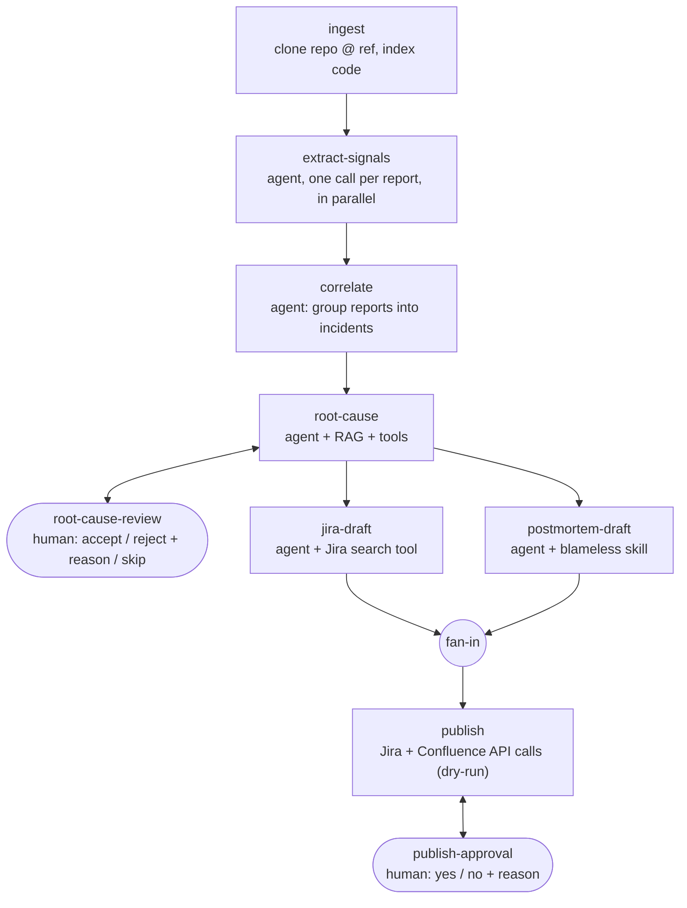

# 04 · Incident triage (multi-agent workflow + real RAG)

A .NET 10 / C# 14 console app built on **Microsoft Agent Framework** (`Microsoft.Agents.AI` 1.23 + `Microsoft.Agents.AI.Workflows`).
You point it at a repository (plus an optional commit id or git tag; the default is `main`), paste one or more incident reports, and five small agents work through them, with a human reviewing at two points:



Everything the AI produced and every human decision, **with the reason**, is written to `output/<run-id>/journal.json`, next to the ticket JSON and postmortem markdown.

It runs **offline by default**, with scripted mock clients and a hashing embedder, so the whole pipeline (tool-call loops, RAG injection, structured output, the feedback loop) runs for real without API keys.

---

## Run it

```bash
cd 04-incident-triage/src/IncidentTriage
dotnet run
```

You'll be asked for:

1. **Repository**: a GitHub URL, `owner/repo`, or a local folder. Press Enter for the bundled demo repo.
2. **Commit id or git tag**: press Enter for `main`.
3. **The reports**: paste them, separate several with a line containing only `---`, and finish with a line containing `END`. Type `END` straight away to use the four sample reports in `SampleData/reports/`.

Then review each root-cause hypothesis: `a` accept, `r` reject (a reason is required and is sent back to the agent), `s` skip. Try rejecting the first one to watch the agent come back with a different hypothesis.

Useful switches:

| Switch | What it does |
|---|---|
| `--repo <url\|owner/repo\|path>` `--ref <sha\|tag\|branch>` | Skip the repository prompts. |
| `--reports <file\|folder>` | Load reports from a file (split on `---`) or a folder (one file per report). |
| `--yes` | Auto-accept every review (demo / CI). |
| `--mermaid` | Print the workflow graph as generated by `WorkflowVisualizer` from the real `Workflow` object. |
| `--Reviewer <name>` | Name stored with human decisions (default: your OS user). |
| `--Ai:Provider OpenAI` (or any config key) | Override configuration from the command line. |

Set `MOCK_TRACE_FILE=trace.txt` to see exactly what each agent receives: instructions (house rules + prompt + the skills list the framework adds), the injected RAG context, tool calls and tool results.

### With a persistent RAG store (PostgreSQL + pgvector)

By default the vector index is in memory. To keep embeddings in Postgres (runbooks are embedded once, later runs reuse them):

```bash
docker compose up -d
cd src/IncidentTriage
dotnet run -- --Triage:Rag:ConnectionString "Host=localhost;Port=5433;Username=triage;Password=triage;Database=triage"
```

The app creates the `vector` extension and `chunks` table itself; `docker compose down -v` resets the data. The code collection is still cleared and rebuilt per run. See `Rag/PgVectorIndex.cs`.

### With a real model

```bash
# Azure OpenAI / Azure AI Foundry (keyless: uses az login / managed identity when ApiKey is empty)
dotnet user-secrets set Ai:Provider AzureOpenAI
dotnet user-secrets set Ai:Endpoint https://<resource>.openai.azure.com
dotnet user-secrets set Ai:ChatModel <chat deployment>
dotnet user-secrets set Ai:EmbeddingModel <embedding deployment>

# or OpenAI (or any OpenAI-compatible endpoint via Ai:Endpoint)
dotnet user-secrets set Ai:Provider OpenAI
dotnet user-secrets set Ai:ApiKey sk-...
```

Jira and Confluence stay in **dry-run** (they print the request they would send) until you set `Jira:DryRun=false` / `Confluence:DryRun=false` and the `JIRA_EMAIL` / `JIRA_API_TOKEN` environment variables.

---

## What to look at, by concept

| Concept | Where | Notes |
|---|---|---|
| Agents from `IChatClient` | `Agents/AgentFactory.cs` | `chatClient.AsAIAgent(new ChatClientAgentOptions { ... })`. One prompt file, one job, least-privilege tools per agent. |
| Structured output | `Workflow/Executors/*` | `agent.RunAsync<T>(...)` with records from `Workflow/Messages.cs`; `[Description]`s become schema text the model reads. |
| Workflow graph | `Workflow/TriageWorkflow.cs` | `WorkflowBuilder` with edges, `AddFanOutEdge`, `AddFanInBarrierEdge`, `WithOutputFrom`. |
| Executors | `Workflow/Executors/` | `Executor<TIn,TOut>` for single-input steps; `ConfigureProtocol` + routes for multi-message steps. |
| Human in the loop | `RootCauseExecutor`, `PublishExecutor`, `Program.cs` | `AddExternalCall<TRequest,TResponse>` ports, `RequestInfoEvent`, `request.CreateResponse(...)`. |
| Feedback loop with memory | `RootCauseExecutor` | One `AgentSession` per incident, so a rejection reason lands in the same conversation as the rejected answer. |
| RAG, push style | `AgentFactory.CreateRootCauseAnalyst` | Built-in `TextSearchProvider` (BeforeAIInvoke) injects runbooks and past postmortems before every call. |
| RAG, pull style | `Tools/CodeTools.cs` | `search_code` / `read_file` tools over the indexed repo: the model decides what to look for. |
| Small-to-big retrieval | `Rag/KnowledgeIndex.cs` | Search small chunks, return the whole runbook they belong to. |
| Embeddings + vector index | `Rag/` | Any `IEmbeddingGenerator`; cosine search with `TensorPrimitives`. Notes on moving to Azure AI Search / pgvector. |
| Tools | `Tools/` | `AIFunctionFactory.Create` over plain methods; path-traversal guard; JQL escaping. |
| MCP (commented out, mocked) | `Tools/McpObservabilityTools.cs` | `McpClient` over stdio / HTTP for a Grafana-style log server; the mocked `query_logs` has the same shape. |
| Skills | `Skills/*/SKILL.md` | Agent Skills format, served by `AgentSkillsProvider` (progressive disclosure via `load_skill`), filtered per agent. |
| Prompts and instructions | `Prompts/`, `Instructions/` | Loaded at runtime by `Prompting/PromptLibrary.cs`; shared house rules are prepended to every agent. |
| Agent middleware | `AgentFactory.Build` | `agent.AsBuilder().Use(...)` logs and journals every tool call. |
| Side effects behind a gate | `Tools/JiraClient.cs`, `PublishExecutor` | Agents may *read* Jira; only deterministic code *writes*, after approval. |
| Custom events | `Workflow/TriageEvents.cs` | `TriageProgressEvent` + a C# 14 `extension(IWorkflowContext)` block. |
| Offline mocks | `Ai/Mock/` | Scripted `IChatClient` that really emits tool calls and reads RAG context; hashing `IEmbeddingGenerator`. |

## Folder layout

```
04-incident-triage/
├─ IncidentTriage.slnx, Directory.Build.props, Directory.Packages.props   (self-contained build)
└─ src/IncidentTriage/
   ├─ Program.cs            composition root + event loop
   ├─ Agents/               AgentFactory, agent names
   ├─ Ai/                   model clients (Azure OpenAI / OpenAI / Mock), JSON options, mocks
   ├─ Workflow/             messages, events, graph, executors
   ├─ Rag/                  chunking, vector index, knowledge index
   ├─ Tools/                code + git tools, Jira, Confluence, MCP example
   ├─ Repo/                 clone at commit / tag
   ├─ Persistence/          journal (AI output + human decisions with reasons)
   ├─ Prompts/              one system prompt per agent        ← edit without recompiling
   ├─ Instructions/         house rules shared by all agents   ← edit without recompiling
   ├─ Skills/               Agent Skills (SKILL.md)            ← edit without recompiling
   ├─ Knowledge/            runbooks + past postmortems (RAG)  ← edit without recompiling
   └─ SampleData/           sample reports, demo repo, fake git log
```

## Design notes

- **Why a fixed graph and not a "manager" agent?** Triage has a known shape and the human gates must sit in known places. Hand-built graphs are auditable. `MagenticWorkflowBuilder` (planner agent) or `HandoffsWorkflowBuilder` fit open-ended tasks better.
- **Why store reasons?** "Rejected: the deploy only touched logging" is a labelled example. Collected over time they become an evaluation set for prompt changes, and show which runbooks mislead the agent.
- **Prompt injection.** Reports, logs and tool results are untrusted. They're fenced with `<<<`/`>>>`, the house rules say they are data, tools validate their arguments, and nothing with side effects runs without a human.
- **Checkpointing.** Not enabled, to keep the sample short. Pass a `CheckpointManager` to `InProcessExecution.RunStreamingAsync` to persist each superstep and resume a run after a reviewer answers hours later; the comments in `RootCauseExecutor` say what state would need persisting.

## Limitations

- The offline mock reasons with regexes. It is there to exercise the plumbing, not to be clever; switch to a real model to see real judgement.
- The default in-memory vector index re-embeds the knowledge base and the repository on every run (use the Postgres store above to avoid that for the knowledge base). Fine for a sample, expensive for a big repo with a real embedding model; see `Rag/InMemoryVectorIndex.cs`.
- Local folders are read as-is (their working tree), so the commit/tag prompt only applies to remote repositories.
