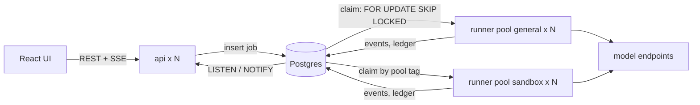
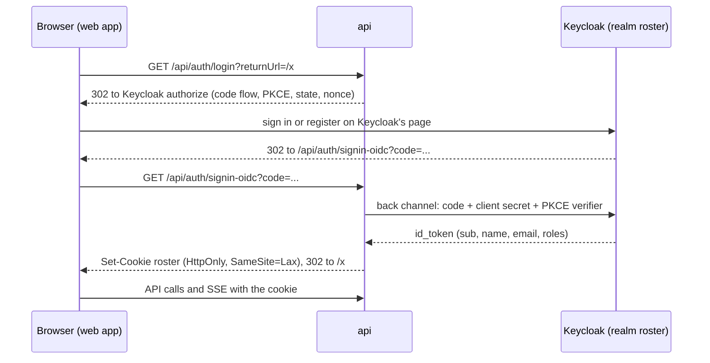
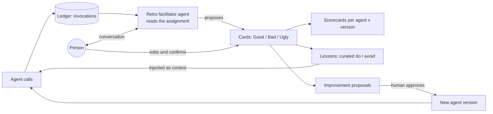
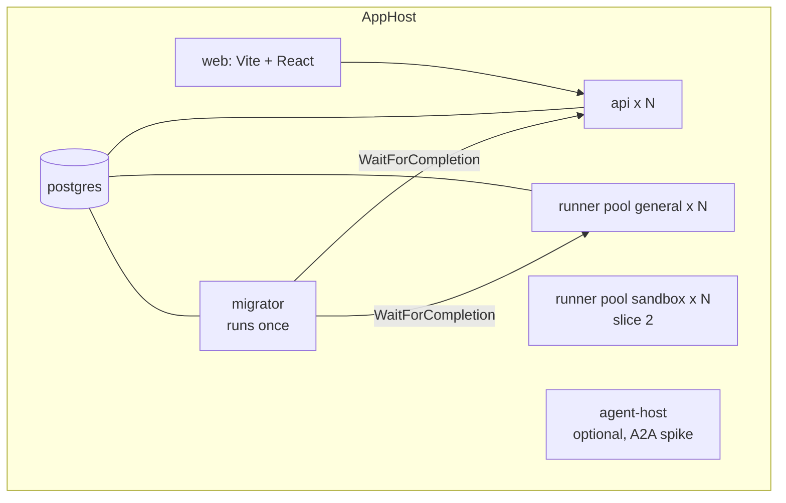

# Roster: architecture

Roster is a platform where **agents are first-class, reusable, versioned units** instead of personas buried inside
one app. People give an **assignment** to a team of agents, work through it, and finish with a **conversational mini
retro** that feeds back into how each agent behaves. It is built to scale out: a thin API, pools of runners, and
optional remote agent services, orchestrated locally and in deployment by Aspire.

This document is the source of truth for the design. It records what is decided, what was verified and when, and what
is still open. Samples `01` to `04` are the reference material it grows out of; nothing here imports their code.

- [1. Goals and non-goals](#1-goals-and-non-goals)
- [2. Decisions at a glance](#2-decisions-at-a-glance)
- [3. Vocabulary](#3-vocabulary)
- [4. The agent package](#4-the-agent-package)
- [5. Runtime kinds and output strategies](#5-runtime-kinds-and-output-strategies)
- [6. Placement: where an agent runs](#6-placement-where-an-agent-runs)
- [7. Runner, jobs and events](#7-runner-jobs-and-events)
- [8. Models: endpoints, tiers and the UI picker](#8-models-endpoints-tiers-and-the-ui-picker)
- [9. Credentials: bring your own key, bring your own seat](#9-credentials-bring-your-own-key-bring-your-own-seat)
- [10. Identity](#10-identity)
- [11. Feedback: ledger, retro, scorecards, lessons](#11-feedback-ledger-retro-scorecards-lessons)
- [12. Memory and retrieval](#12-memory-and-retrieval)
- [13. Aspire topology](#13-aspire-topology)
- [14. Scenarios and slices](#14-scenarios-and-slices)
- [15. Verified facts](#15-verified-facts)
- [16. Risks and open questions](#16-risks-and-open-questions)
- [17. Working agreement](#17-working-agreement)

## 1. Goals and non-goals

**Goals**

1. Agents live in a **library**, separate from the apps that use them. Each agent owns its instructions, skills,
   tools (by capability), typed input and output, model tier and memory scopes.
2. Scenarios (workflows) **compose** library agents. They own the mapping between one agent's output and the next
   agent's input, so agents never know about each other.
3. Every agent call is recorded against the **exact agent version** that made it, so feedback attaches to something
   specific and "v3 beats v2" can be answered.
4. Feedback is a **conversation**: a retro facilitator agent talks to the person, can read the assignment's outputs,
   chats and (when the endpoint provides it) reasoning, and turns the discussion into Good / Bad / Ugly cards.
5. The system is **more than a website**. The API is thin and stateless, work runs in runner pools, and agents can be
   placed in-process, in a locked-down pool, or behind a service.
6. People choose the model endpoint for an assignment **in the UI**, using their own keys or their own Copilot seat.

**Non-goals**

- Automated tests. By decision there are no test projects. Verification is compiling, running the stack and looking
  at it. A tiny `fake` model endpoint exists so the whole system can run offline and demo scale without spending
  tokens; it is a dev and demo tool, not a test harness.
- Enterprise identity, billing, multi-region. This is a personal project with the architecture to grow.
- Auto-applying prompt changes. Humans approve every change to an agent.

## 2. Decisions at a glance

| # | Decision | Why | State |
|---|---|---|---|
| D1 | Agents are packages: `AGENT.md` + contracts + skills, depending only on `Roster.Agents.Abstractions` | Reuse; non-developers can edit behaviour | Decided |
| D2 | Archetypes share contracts and skills, never collapse agents | Each agent keeps its own prompt, version and scorecard | Decided |
| D3 | Tools are named **capabilities** with a risk class; hosts bind them | Library stays free of Jira, GitHub, file systems | Decided |
| D4 | Placement is policy: highest risk class + runtime kind set the minimum isolation | Safety by construction, not convention | Decided |
| D5 | A Postgres `jobs` table is the queue, behind `IJobQueue` and `IEventBus` | Fewer moving parts; swappable for RabbitMQ or NATS | Decided |
| D6 | Phases are plain C# steps persisted in Postgres; Agent Framework graphs may be used inside a phase | Agents evolve under feedback, so old checkpoints are a trap | Decided |
| D7 | Endpoints are data; the UI picks one per assignment (or per step); resolution order is fixed | Matches how the owner wants to work | Decided |
| D8 | Per-user credentials in an AES-GCM vault; jobs carry ids, never secrets | Users bring their own keys and Copilot seat | Decided |
| D9 | Output strategy is owned by the runtime, per runtime kind | `RunAsync<T>` exists only on `ChatClientAgent` | Decided |
| D10 | Identity is **Keycloak** (OpenID Connect) through Aspire's Keycloak integration; the API signs people in backend-for-frontend style and keeps a cookie. Roles `admin` and `member` are realm roles; the free-text `title` lives in the app profile, shown as `Name · Title` | Owner wants Keycloak in the Aspire topology and accepts that the integration is preview. A real identity provider from day one; registration, password policy and the admin console come free | Decided, built and run (2 Oct 2026) |
| D11 | The retro is a chat with `retro-facilitator`; cards are confirmed by the person | Owner asked for a conversation, not a form | Decided |
| D12 | Postgres everywhere; pgvector arrives with slice 2 (lessons, knowledge) | One store for state, queue, vectors and full-text | Decided |
| D13 | Remote (A2A) placement is spiked separately in `spikes/a2a-agent-fleet`, not built into the platform yet | A2A packages are preview; teams owning agents is a later goal | Decided |
| D14 | .NET 10 (LTS), Aspire 13.6, Agent Framework 1.23 (GA packages only) | Latest GA of each | Decided |

## 3. Vocabulary

| Term | Meaning |
|---|---|
| **Agent** | A package: instructions, skills, capabilities, input and output contracts, model tier. Identified by name and content hash. |
| **Contract** | A C# record (with `[Description]`s) for an agent's input or output. The JSON schema is derived from it. The root is always an object. |
| **Capability** | A named permission such as `repo.read` or `jira.search`, with a risk class. Hosts map capabilities to concrete tools. |
| **Risk class** | `read`, `write-local`, `exec`, `write-external`. |
| **Runtime kind** | How an agent runs: `chat` (Agent Framework `ChatClientAgent` over any OpenAI-compatible endpoint), `copilot` (Copilot SDK), `remote` (A2A). |
| **Placement** | Where it runs: `in-process`, `pool`, `remote`. |
| **Endpoint** | A model endpoint someone configured: kind, base URL, credential reference, default model, capabilities, limits. |
| **Tier** | `fast`, `balanced`, `reasoning`. An agent asks for a tier; routing maps it to an endpoint and model. |
| **Credential** | A secret a user stored: an API key, or a GitHub token for their Copilot seat. |
| **Assignment** | A unit of work given to a team of agents, owned by a person. A run of a scenario. |
| **Phase** | A stage of a scenario (fetch, review, triage). Persisted; the unit of retry. |
| **Job** | A row in the queue telling a runner to execute a phase or a facilitator turn. |
| **Invocation** | One agent call, recorded in the ledger with agent version, endpoint, model, input, output, tool calls, reasoning if available, tokens, latency and trace id. |
| **Retro** | A conversation with the retro facilitator about an assignment, ending in confirmed cards. |
| **Card** | A Good, Bad or Ugly item: text, author (name and title), optional link to an agent, step or output. |
| **Lesson** | A short curated "do / avoid" distilled from retros. Retrieved per agent and scope. Slice 2. |

## 4. The agent package

```
agents/
  reviewers/
    security-reviewer/
      AGENT.md          front matter + instructions (markdown; editable by non-developers)
      skills/           private SKILL.md files; shared ones live in the library's skills/ folder
  retro/
    retro-facilitator/
      AGENT.md
Contracts/              input and output records, shared by archetypes
```

```yaml
---
name: security-reviewer
description: Surface-level security review of a code change.
archetype: reviewer
tier: balanced                    # a tier, not a model name
skills: [owasp-lens, untrusted-input]
capabilities: [repo.read, repo.search]
input: ChangeReviewInput
output: Findings
output-strategy: native           # native | tool | prompted
---
You review a pull request for security issues visible at a surface level...
```

Rules:

1. The library references only `Roster.Agents.Abstractions`. It never references a workflow, a host, Jira or GitHub.
2. **Version identity** is a content hash of the instructions, resolved skills, capabilities, tier and the output
   schema. Every invocation stores it. A human-readable `version` label may be bumped, but the hash is what scorecards
   key on.
3. Skills use the portable `SKILL.md` format. Slice 1 appends skills to the instructions. The manifest reserves
   `skill-mode: on-demand` for progressive disclosure through Agent Framework's skills provider.
4. Reviewers share `Findings` and a triage UI, but `security-reviewer` and `design-reviewer` stay separate agents
   with their own prompt, version and scorecard.
5. Behaviour edits made in the UI become new **agent versions** stored in the database; the library ships the baseline.
   The running version of an agent is the latest approved one, falling back to the library baseline.

## 5. Runtime kinds and output strategies

| Kind | Backed by | Loop owner | Typed output |
|---|---|---|---|
| `chat` | `ChatClientAgent` over an `IChatClient` | the platform | native JSON schema, or prompted JSON with validate-and-repair |
| `copilot` | Copilot SDK session (slice 2) | the Copilot runtime | SDK `ResponseSchema` (experimental), else terminal tool or prompted JSON |
| `remote` | A2A (see the spike) | the remote service | server-side schema; client validates against the published contract |

Why the runtime owns the output strategy: in Agent Framework `RunAsync<T>` exists only on `ChatClientAgent` (ADR 0036),
decorators such as the telemetry wrapper hide it, and neither the Copilot wrapper nor the A2A agent takes a response
schema. So the platform builds the schema from the contract, applies the strategy the runtime supports, then validates
and, if needed, makes one repair attempt before failing the step.

Reasoning ("thinking") is captured when the endpoint returns it as `TextReasoningContent`. It depends on the endpoint:
reasoning summaries from some Responses-style APIs, thinking blocks from some providers, nothing from plain
chat-completions servers. It is stored with the invocation, subject to retention, and is what the retro facilitator
reads when it exists.

## 6. Placement: where an agent runs

| Placement | Runs in | For | Cost |
|---|---|---|---|
| `in-process` | the runner executing the step | thinking-only agents: reviewers, analysts, writers | none |
| `pool` | a locked-down runner pool: same code, own volume and credentials | agents that write or execute: developer, tester, anything on Copilot | a queue tag |
| `remote` | its own service, called over A2A | foreign or independently owned agents | a network protocol; A2A packages are preview |

The rule: every capability has a risk class. The highest class an agent uses, plus its runtime kind, sets the
**minimum** placement. A manifest may ask for more isolation. Nobody can configure less.

`IAgentInvoker` has a local implementation now and an A2A implementation later. **The caller writes the ledger**, so
history looks the same wherever the agent ran.

## 7. Runner, jobs and events



- **Queue.** A `jobs` table: `kind`, `pool`, `payload`, `state`, `attempts`, `not_before`, `lease_until`,
  `locked_by`, `idempotency_key`, `traceparent`. A runner claims with `FOR UPDATE SKIP LOCKED`, extends its lease on a
  heartbeat, and either completes or fails the job. An expired lease makes the job claimable again. Retries back off.
- **Idempotency.** Steps may run twice after a crash. Ledger rows are keyed by `(phase, attempt)`. Side-effecting
  tools take an idempotency key, or are only invoked from deterministic steps behind a human gate.
- **Events.** Runners write `run_events` and `NOTIFY`. API replicas `LISTEN` and stream to browsers over SSE. Payloads
  carry ids; the SSE handler reads the row.
- **Tracing.** The job row carries `traceparent`, so one OpenTelemetry trace spans API, runner, model call and tool.
- **Cancel.** A flag on the assignment plus a cancellation token passed to the agent call.
- **Seam.** `IJobQueue` and `IEventBus`. RabbitMQ or NATS (Aspire has integrations for both) can replace them. A
  Postgres queue is comfortable into the low thousands of jobs a minute; beyond that, swap the implementation.
- **Streaming chat.** The retro facilitator writes its in-progress message to `retro_messages` at most every 250 ms
  and notifies; the UI shows partial text. A real pub/sub replaces this when the bus is swapped.

This is the production-shaped version of what sample 02 does in-process with a channel, a `PhaseWorker` and a
requeue-on-startup step (`02-sdlc-studio-web/src/SdlcStudio.Api/Orchestration/Infrastructure.cs`).

## 8. Models: endpoints, tiers and the UI picker

An endpoint is a row an admin or a user creates:

| Field | Notes |
|---|---|
| `kind` | `openai` (any OpenAI-compatible: OpenAI, Azure/Foundry, Ollama, vLLM, LiteLLM), `fake` (dev and demo), `copilot` (slice 2) |
| `base_url`, `default_model` | |
| `credential_id` | A reference into the vault. The key is never in this row. |
| `capabilities` | structured output: `native` / `none`; tool calling; streaming; reasoning (rejects temperature); embeddings |
| `limits` | max concurrency, requests per minute; used by the runner as a per-endpoint gate |
| `owner` | `null` for shared endpoints, otherwise the user's id |

**Choosing.** The picker is in the UI, not in chat. When creating an assignment a person picks an endpoint (their own
or a shared one) and optionally a model. An "advanced" panel can override single phases or steps. Resolution order:

1. step override, 2. phase override, 3. assignment choice, 4. the agent's default in that scenario,
5. the agent's tier mapped through the user's tier map, 6. the global default.

The ledger records the endpoint, model, runtime kind and output strategy that actually ran. If an endpoint declares no
structured-output support, the picker warns that agents will use prompted JSON with validate-and-repair.

Aspire can bootstrap a few shared endpoints with secret parameters (`AddOpenAI(...).WithEndpoint(...)` exists for this);
the database holds everything else.

## 9. Credentials: bring your own key, bring your own seat

Users supply their own credentials and the app uses them in the background on their behalf. This is supported.

**Vault.** `user_credentials` stores AES-256-GCM ciphertext. The key comes from a secret parameter
(`Parameters:vault-key`), generated for dev by the AppHost. Associated data binds each ciphertext to
`(user id, credential id, kind)`, so a ciphertext copied to another row or user fails authentication. The UI is
write-only: after saving, only a masked hint is shown. Jobs carry `credential_id`s, never secrets. The runner loads and
decrypts in memory just before the call, and nothing logs or traces secret values.

| Kind | What the user provides | Used for |
|---|---|---|
| `api-key` | An OpenAI-compatible key (BYOK) | `chat` endpoints; or as the provider config of a `copilot` session in BYOK mode |
| `github-token` | A fine-grained PAT (`github_pat_`), or an OAuth or GitHub App user token (`gho_` / `ghu_`) | `copilot` sessions that run on the user's own Copilot seat |

Per the Copilot SDK's docs (verified 2 Oct 2026): the supported token types are `gho_`, `ghu_` and `github_pat_`;
classic `ghp_` tokens are not supported. The application owns storage, refresh and expiry. For multi-user hosts the SDK
supports a **per-session `gitHubToken`**, or one client (and runtime) per user, which is its recommended and strongest
isolation. A shared runtime must run in `mode: "empty"` with explicit tool allowlists, unique session ids that include
the user boundary, ownership checks before resume or delete, and `sessionIdleTimeoutSeconds`. The default
`copilot-cli` mode exposes the host filesystem and must not be used for multi-user serving. BYOK needs no Copilot seat.

Roster's choice for the sandbox pool: **one isolated runtime per job**, started with the job owner's token, torn down
with the job. It is the simplest correct option and the jobs are long-running anyway.

Build-time gotcha: `GitHub.Copilot.SDK` downloads a pinned Copilot CLI runtime from `github/copilot-cli` releases during
`dotnet build` (with a SHA-256 check). It is referenced only from the sandbox runner project. Set
`CopilotSkipCliDownload=true` where the runtime isn't needed, or `CopilotCliReleaseBaseUrl` to use a mirror.

## 10. Identity

**Keycloak** is the identity provider, added to the AppHost with `Aspire.Hosting.Keycloak` and used from the API with
`Aspire.Keycloak.Authentication`. Both are preview; Keycloak itself is not. The owner chose it over ASP.NET Core
Identity knowing that.



- **Backend-for-frontend.** The API is a confidential client (`roster-api`) and runs the code flow. The browser only
  ever holds an HttpOnly cookie, never a token, and `EventSource` works because it sends cookies. The web app's dev
  proxy forwards `/api`, so the callback lands on the web app's origin and the cookie is set there.
- **Who owns what.** Keycloak owns accounts, passwords, registration and the permission roles `admin` and `member`
  (realm roles, emitted as a flat `roles` claim). New accounts get `member`. A seeded `admin@roster.local` gets
  `admin`. The app keys its own `AppUser` row by the token's `sub` and stores what Keycloak does not: the free-text
  **title** (`Security Engineer`, `Product Owner`, ...) shown as `Priya Nair · Security Engineer` and snapshotted onto
  every card and decision, so feedback can later be weighed by who gave it.
- **Endpoints.** `GET /api/auth/login`, `GET /api/auth/register` (`prompt=create` opens Keycloak's registration page),
  `POST /api/auth/logout` (a form post; also ends the Keycloak session with `id_token_hint`), `GET /api/auth/me`. Every
  other endpoint requires a signed-in person by default; `admin` is a named policy.
- **CSRF.** Unsafe requests must carry an `X-Roster` header in addition to the `SameSite=Lax` cookie. Logout is the one
  exception, because it is a top-level form post that ends in a redirect to Keycloak.
- **Local setup.** The realm (`src/Roster.AppHost/Realms/roster-realm.json`, explained by the README next to it) is
  imported on first start. The client secret and the seeded admin password are generated by the AppHost, kept in its
  user secrets and handed to Keycloak as import placeholders, so nothing secret is committed. Keycloak keeps its data
  in a volume; to re-import after editing the realm, remove the volume.
- **Not used:** pushed authorization requests (PAR). The .NET handler uses them when Keycloak offers them, but Keycloak
  26.6 ignored `prompt=create` inside a pushed request, and local sign-in does not need them.
- **Deployment later.** `WithRealmImport` is development-only. A deployed Keycloak needs the realm baked into an image or
  applied by a seeding job, and `Keycloak:Authority` set to an `https` URL.

## 11. Feedback: ledger, retro, scorecards, lessons



**Retro as a conversation.** At any time (and prompted when an assignment finishes) a person opens the Retro tab and
talks to `retro-facilitator`. The facilitator is an ordinary library agent with read-only capabilities scoped to that
assignment and its owner:

- `get_overview`, `list_steps`, `get_step(stepId)` for inputs, outputs and findings,
- `get_decisions` for what the person accepted or rejected and why,
- `get_chat(stepId)` for conversational steps,
- `get_reasoning(stepId)` where the endpoint returned reasoning,
- `get_tool_calls(stepId)`.

It opens from a short **timeline of moments** (rejected findings with their reasons, rework loops, retries, slow or
costly steps, edits before approval) and asks a few focused questions rather than presenting a form. When the person
agrees to wrap up it calls `propose_cards`, which returns Good / Bad / Ugly cards (text, optional agent and step link).
The UI shows them as editable drafts; **the person confirms**, and the saved card is authored by the person with an
`assisted_by` mark. Nothing the facilitator drafts is saved without confirmation. The conversation itself is kept
(it is a ledger entry like any other).

**Scorecards.** Per agent and version: acceptance rate, Good / Bad / Ugly mix, recurring phrases, rework loops, tokens
and cost, sliced by the author's title.

**Lessons (slice 2).** A curator agent clusters cards for an agent into short "do / avoid" candidates with evidence
links. A person promotes them; active lessons are retrieved per agent and scope and injected as fenced, untrusted
context. Lessons can be pinned or retired.

**Improvement proposals (slice 2).** The curator drafts a diff to an agent's instructions or skills with the evidence.
A person approves it and it becomes the next version. It is never auto-applied.

## 12. Memory and retrieval

Worth it in two places, not three.

1. **Lessons** (above): small, curated, highest value.
2. **Knowledge** (runbooks, standards, ADRs, past postmortems) for agents that declare it. Search small chunks, return
   the whole parent document, group by document for diversity.

Not code embeddings at first. Identifiers and error strings are lexical; grep, read and git tools get most of the value
without re-embedding a repository per commit.

One store: Postgres with pgvector, full-text search for hybrid retrieval, scope filters in plain SQL. Agents contain no
retrieval code; the manifest declares what they read and the runtime attaches the providers. Working memory is the
message history, persisted per retro session and per assignment step. pgvector images use tags such as `pg17`, and
Aspire derives the data directory from the image tag, so that wiring is checked when slice 2 lands.

## 13. Aspire topology



- `WithReplicas` on `api` and `runner` is how scale is shown. For projects with endpoints, a stable proxy port fronts
  the instances; runners have no inbound endpoints and are plain parallel processes.
- A `migrator` project applies schema changes once; `api` and `runner` wait for it to complete.
- Secrets (`vault-key`, bootstrap endpoint keys) are Aspire parameters.
- The dashboard shows distributed traces across api, queue, runner and model calls. The GenAI view needs message-content
  capture enabled (`OTEL_INSTRUMENTATION_GENAI_CAPTURE_MESSAGE_CONTENT=true`); keep it off outside development. In 13.6
  the dashboard keeps run history (SQLite, up to ten completed runs per app, read-only).
- `aspire publish` produces Docker Compose files, Kubernetes manifests or Bicep; `aspire deploy` applies to Azure
  Container Apps, App Service or Kubernetes.

## 14. Scenarios and slices

| Slice | Scenario | Proves |
|---|---|---|
| 1 | **PR review**: fetch (or fixture), three reviewer agents in parallel, human triage with reasons, retro | Agent library, ledger, endpoint picker, runner, retro conversation, scorecards |
| 2 | **Incident triage**: signals, correlation, root cause with knowledge retrieval, drafts. Plus the sandbox pool and a Copilot-backed developer | pgvector, lessons, placement policy, per-user Copilot token |
| 3 | **Idea to code**: interviewer, specs, planning, development, merge request | The long, multi-phase, human-gated shape |

Phases are plain C# classes persisted in Postgres. Agent Framework workflow graphs (fan-out, fan-in, loops) may be used
inside a phase when they earn it.

## 15. Verified facts

Checked on 2 Oct 2026 against package pages, the docs sources and the framework repositories. `aspire.dev`,
`learn.microsoft.com`, `devblogs.microsoft.com` and `docs.github.com` were unreachable from the authoring sandbox, so
Aspire facts come from the `microsoft/aspire.dev` docs source and Copilot facts from the `github/copilot-sdk` repository.

| Item | Fact |
|---|---|
| Aspire | 13.6.0 (published 29 Sep 2026). `AddViteApp`, `WithReplicas`, `AddOpenAI(...).WithEndpoint(...)`, `WithRepl`, `aspire publish` / `aspire deploy`. Keycloak integration is preview (`13.6.0-preview.1.26479.8`, image `quay.io/keycloak/keycloak:26.6`, starts with `start-dev --import-realm`, switches to HTTPS when a dev certificate is present). No pgvector support in the Postgres integration. |
| Aspire dashboard | GenAI visualizer exists; best with message content recorded. 13.6 keeps up to ten completed runs per application. |
| Agent Framework | `Microsoft.Agents.AI`, `.Workflows`, `.GitHub.Copilot` are 1.23.0 stable. A2A, AG-UI hosting are `1.23.0-preview`. DurableTask is `1.16.0-preview` and lives in its own repository. |
| Structured output | `RunAsync<T>` only on `ChatClientAgent`; decorators hide it (ADR 0036, proposed). |
| Copilot SDK | `GitHub.Copilot.SDK` 1.0.16. Per-session `gitHubToken`; `gho_`, `ghu_`, `github_pat_` supported; BYOK needs no seat; native `ResponseSchema` is experimental; downloads the CLI runtime at build time. |
| GitHub Models | **Retired on 30 Jul 2026.** The Aspire integration was removed in 13.6. Samples `01` to `03` still advertise a `GitHubModels` provider; it no longer works. |
| .NET | 10 is the current LTS. 11 is at RC1 with GA on 10 Nov 2026. |
| Frontend | React 19.3.0, Tailwind 4.3.3 (`@tailwindcss/vite`), Vite 8.3.2, TypeScript 7.0.2, React Router 8.4.0, TanStack Query 5.104.1. |
| Data | `Npgsql.EntityFrameworkCore.PostgreSQL` 10.0.3, `Microsoft.Extensions.VectorData.Abstractions` 10.10.0. |

## 16. Risks and open questions

- **Only partly run end to end.** The second session found Docker usable in the sandbox and ran the AppHost: Keycloak
  imported the realm, and a browser signed in as the seeded admin and as a newly registered member, signed out (ending
  the Keycloak session) and was refused an open redirect. Everything else in the topology is still to be run.
- **Keycloak integration is preview.** Its API may change between Aspire releases. The surface used is small:
  `AddKeycloak`, `WithDataVolume`, `WithRealmImport`, `AddKeycloakOpenIdConnect`.
- **Copilot specifics.** The SDK's structured output is experimental, and the runtime download happens at build time.
  Both are isolated to the sandbox runner project.
- **A2A is preview.** The server still ships a stub agent card. See the spike for what a contract-first fleet needs.
- **Reasoning capture is endpoint-dependent** and may contain sensitive content. It is retained for a limited time and
  only the assignment's owner and the facilitator can read it.
- **Prompt injection.** Everything from outside (PR text, diffs, retro messages, lessons, knowledge) is fenced and
  labelled untrusted. Reviewers are read-only. Anything that writes sits behind a gate.
- **Open:** token streaming through Postgres is a stopgap; the bus swap replaces it. Per-endpoint rate limiting is
  per-runner in slice 1 and becomes global with a shared counter.

## 17. Working agreement

Small commits on `claude/modest-lamport-rm5j2v`. No pull requests unless asked. No tests. Comments explain why, not what.
