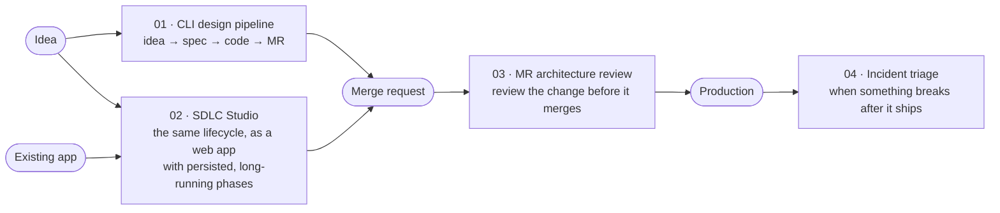

# Agent Framework sandbox: .NET agentic workflow samples

Four end-to-end samples showing how to build **multi-agent workflows** in C# with
[Microsoft Agent Framework](https://learn.microsoft.com/agent-framework/overview/agent-framework-overview)
(`Microsoft.Agents.AI` + `Microsoft.Agents.AI.Workflows` 1.23, on `Microsoft.Extensions.AI` 10.10).
None of them is a single chat agent: each one wires several small, focused agents, plain C# steps,
tools and human decisions together in a workflow graph, around a real software-delivery task.

Every sample:

- targets **.NET 10 / C# 14** and is **self-contained** (its own `.slnx`, `Directory.Build.props` and
  `Directory.Packages.props`), so you can copy one folder out and it still builds;
- runs **offline by default** against a scripted mock `IChatClient`, so agents, tool calls, structured
  output, loops and fan-out all execute for real without an API key, and switches to OpenAI, Azure OpenAI
  or GitHub Models with one setting. **Note:** GitHub Models was retired on 30 July 2026, so the `GitHubModels`
  provider option in samples 01 to 03 no longer works; use OpenAI, Azure OpenAI / Foundry or any
  OpenAI-compatible endpoint instead;
- is **heavily commented**: each file says why it is written that way, which alternatives were
  considered, and links to the docs;
- keeps agent behaviour in **Markdown prompts, skills and instructions** loaded at runtime, so you can
  change what an agent does without recompiling.

## The samples

| # | Sample | Host | What it does |
| --- | --- | --- | --- |
| 01 | [CLI design pipeline](01-cli-design-pipeline/) | Console | Turns a one-line idea into a reviewed, ready-to-push codebase: "grill me" requirements interview, spec approval, developer and tester agents in a bounded rework loop, then a merge-request agent that updates Jira and Confluence. |
| 02 | [SDLC Studio](02-sdlc-studio-web/) | ASP.NET Core + React | Takes an idea, or an existing app (folder or zip), through design, spec review, agile plan, dev plan, development with MR checkpoints and test prompts, with a human approving each phase and all state in EF Core. |
| 03 | [MR architecture review](03-mr-architecture-review/) | Console | Pulls a GitHub pull request and runs design, security and extensibility reviewers in parallel; a human accepts or rejects each finding with a reason, and those reasons feed later reviews. |
| 04 | [Incident triage](04-incident-triage/) | Console | Points at a repo (plus optional commit or tag) and pasted incident reports; extracts signals, correlates them into incidents, finds a root cause with real RAG over runbooks and code, then drafts the Jira ticket and postmortem. |

## The platform

The samples share no code on purpose. **05 is where their ideas are rebuilt as one platform**: agents become reusable,
versioned packages in a library; scenarios compose them; work runs in runner pools; people pick the model endpoint in
the UI and bring their own keys; and feedback is a conversational retro that feeds back into each agent.

| # | Project | Host | Status |
| --- | --- | --- | --- |
| 05 | [Roster](05-agent-platform/) | ASP.NET Core + React + Aspire | Design in [`05-agent-platform/docs/architecture.md`](05-agent-platform/docs/architecture.md); built in slices. |

## How they fit together

The four samples follow one delivery story and one architecture, and each adds something the
previous one did not need.



- **01 builds something, 02 builds it at scale, 03 reviews it, 04 supports it.** Together they cover
  design, development, review and operations.
- **01 is the reference.** It is the smallest and introduces every building block. Start there.
- **02 is 01 grown up.** Same idea of interview, spec, plan, develop and review, but the human gaps last
  hours or days, so each phase is a short workflow and state lives in a database instead of an in-memory
  `RequestPort`. Its README explains when to choose each approach.
- **03 and 04 start from code that already exists.** Both take a repository plus an optional commit or tag
  (defaulting to `main`), which is what reviewers and on-call engineers actually have in hand.
- **04 is the RAG sample.** The other three show where retrieval would help (01 and 03 with lightweight
  keyword providers, 02 as comments). 04 does it for real: embeddings, a vector index, small-to-big
  retrieval, and the model searching code through tools.

### The shared skeleton

Once you know one sample, the others read the same way:

```
IChatClient (mock / OpenAI / Azure OpenAI / GitHub Models)
  └─ ChatClientAgent per job, built from prompts/ + skills/ + instructions/, least-privilege tools
       └─ wrapped in a typed Executor (structured output via agent.RunAsync<T>)
            └─ WorkflowBuilder graph: edges, loops, fan-out / fan-in, human gates
                 └─ deterministic C# for routing, side effects and persistence
```

The design rules behind that skeleton are the same in every sample:

- **Deterministic structure, AI at the leaves.** The graph is hand-built, plain C# decides routing and owns
  every side effect, and agents only do the parts that need judgement. The prebuilt orchestrations
  (sequential, handoff, group chat, Magentic) are discussed in each sample as the alternative for
  open-ended tasks.
- **Many small agents over one big one.** Short prompts, parallel execution, and per-agent feedback that
  tells you which prompt to tune.
- **Humans decide, and give reasons.** Every approve or reject is stored next to the AI output it judged,
  with the reason, and fed back to the agents. Over time those reasons become an evaluation set.
- **Safe by default.** Untrusted input (PR diffs, incident reports, tool results) is fenced and labelled,
  file tools are sandboxed to a workspace, and anything that writes to Jira, Confluence or GitHub is
  mocked or dry-run until you opt in.
- **Mock at the seams.** The model is mocked at `IChatClient`, REST integrations at `HttpMessageHandler`,
  and MCP with a same-shaped local tool, so as much real code as possible runs offline.

## Where to find each concept

| Concept | 01 CLI pipeline | 02 SDLC Studio | 03 MR review | 04 Incident triage |
| --- | --- | --- | --- | --- |
| Agents built from prompt files | ✓ files | ✓ DB, seeded from files | ✓ files | ✓ files + Agent Skills |
| Structured output (`RunAsync<T>`) | ✓ | ✓ | ✓ | ✓ |
| Typed executors in a `WorkflowBuilder` graph | ✓ | ✓ one workflow per phase | ✓ | ✓ |
| Loops and conditional edges | ✓ dev ⇄ tester | ✓ planner validator, dev ⇄ reviewer | ✓ triage cycle | ✓ reject and retry |
| Fan-out / fan-in | | ✓ three spec reviewers | ✓ three aspect reviewers | ✓ per-report extraction, Jira + postmortem |
| Human in the loop | `RequestPort` | DB state machine over HTTP | `RequestPort` | `RequestPort` |
| Session memory / feedback from human reasons | ✓ `AgentSession` | ✓ serialized sessions, reasons in revise prompts | ✓ custom `AIContextProvider` | ✓ `AgentSession` per incident |
| Function tools | ✓ sandboxed workspace | ✓ codebase, Jira, git | ✓ read-only repo | ✓ code search, git, Jira |
| MCP (commented out or compiled out, mocked) | GitHub | GitHub | GitHub | Observability logs |
| RAG | keyword `AIContextProvider` | comments only | `TextSearchProvider` | embeddings, vector index, `TextSearchProvider` + code tools |
| Jira / Confluence over REST (mocked or dry-run) | ✓ | ✓ | ✓ | ✓ |
| Persistence | run folder | EF Core (LocalDB / SQLite) | JSON + JSONL | journal JSON |
| Streaming progress | console events | SSE to React | console events | console events |

Each sample's own README has a "where to look" table that maps these to exact files.

## Getting started

You need the [.NET 10 SDK](https://dotnet.microsoft.com/download/dotnet/10.0). Sample 02's UI also needs
Node.js and [pnpm](https://pnpm.io/).

```bash
# 01: the reference sample, offline, answers its own interview questions
cd 01-cli-design-pipeline
dotnet run --project src/CliDesignPipeline -- "A tiny task tracker for my team" --auto

# 03: review the bundled sample PR offline; drop --auto to triage the findings yourself
cd 03-mr-architecture-review/src/MrArchitectureReview
dotnet run -- --auto

# 04: triage the bundled sample reports offline, auto-accepting every review
cd 04-incident-triage/src/IncidentTriage
dotnet run -- --yes --reports SampleData/reports
```

Sample 02 has an API and a UI to start; follow its [quick start](02-sdlc-studio-web/README.md#quick-start).

Suggested reading order: **01 → 03 → 04 → 02**. 01 introduces the building blocks, 03 adds parallel
reviewers and a feedback loop, 04 adds real RAG, and 02 shows how to host it all in a web app with
long-running, persisted workflows.

## Repository layout

```
.
├─ README.md                      this file
├─ 01-cli-design-pipeline/        console · prompts/, skills/, instructions/ at the sample root
├─ 02-sdlc-studio-web/            ASP.NET Core API + React UI + tests
├─ 03-mr-architecture-review/     console + tests
├─ 04-incident-triage/            console
└─ 05-agent-platform/             Roster: design doc, then the platform built in slices
```

The samples share no code on purpose: each is meant to be read, copied and changed on its own. Where they
solve the same problem (model client factory, offline mock, prompt loading) you will find similar but
separate implementations; compare them to see the trade-offs each sample made.

## Origin

These samples were first written under `dotnet-agentic-workflows/` in
[leonio/Agent-Framework-Samples](https://github.com/leonio/Agent-Framework-Samples) (draft PRs #1 to #4) and
moved here unchanged, apart from fixing paths in the READMEs and comments and adding `bin/` and `obj/`
to sample 04's `.gitignore` (it previously relied on the parent repo's).
