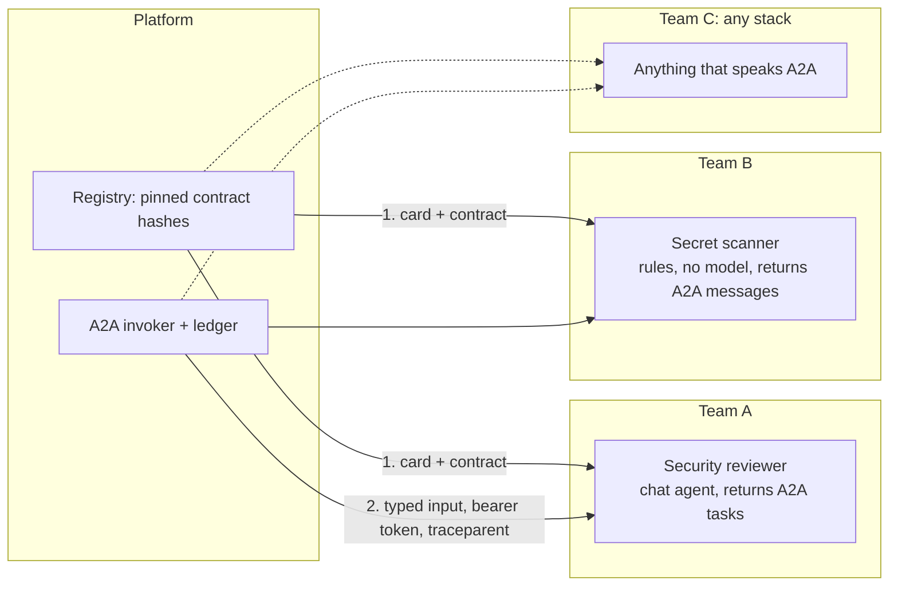

# Spike: an A2A agent fleet

**Question.** Can each team own and run its own agents, however it likes, while a platform treats them like any other
agent?

**Short answer.** Yes, at the protocol level, and the spike runs end to end. The costs are real but small and
known: the A2A packages are preview, a team has to publish a contract the platform can pin, and every endpoint
has to be secured by the team, because the framework does not do it. Details and evidence below.

This is a spike, not part of [Roster](../../05-agent-platform/). It has its own solution and shares no code with the
platform. It exists so the fleet idea is understood and sized before anyone builds it into the platform's `remote`
placement (see section 6 of the [design doc](../../05-agent-platform/docs/architecture.md#6-placement-where-an-agent-runs)).

## The idea



A team decides how its agent works inside. The platform depends on two published documents and a protocol:

| What | Where | Why |
|---|---|---|
| **A2A agent card** | `/.well-known/agent-card.json` | Standard discovery: where to call, which binding, what it supports |
| **Contract document** | `/.well-known/agent-contract.json`, linked from the card through an A2A *extension* | Typed input and output as JSON Schema, a **hash**, the owner, the runtime, the risk class |
| **A2A binding** | `POST /a2a/<name>/message:send` (HTTP+JSON) | The call itself |

The contract hash covers the name, version and both schemas. A platform pins it at registration; when a team changes
the contract the hash changes and the platform refuses the agent until someone re-registers, instead of discovering
the break by parsing garbage.

```json
{
  "contractVersion": "roster.agent/v0",
  "name": "security-reviewer",
  "owner": "team-a",
  "version": "1.3.0",
  "hash": "sha256:1bd715c9...",
  "runtime": "chat",
  "risk": ["read"],
  "interfaces": [{ "binding": "HTTP+JSON", "url": "http://localhost:5101/a2a/security-reviewer" }],
  "input":  { "schema": { "...JSON Schema for ChangeReviewInput..." } },
  "output": { "schema": { "...JSON Schema for Findings..." }, "kind": "findings" },
  "authScheme": "bearer"
}
```

## What is in the folder

| Path | Role |
|---|---|
| `src/TeamA.SecurityReviewer` | An LLM-shaped reviewer built on Agent Framework's `ChatClientAgent`, hosted over A2A, returning **tasks**. The model is a heuristic fake so no key is needed; the structured-output path (response format fixed when the agent is created) is the real one. |
| `src/TeamB.SecretScanner` | A **rules-based** agent with no model: a custom `AIAgent` over regexes, hosted over A2A, returning **messages**. Same contract shape, completely different inside. |
| `src/Shared/FleetContract.cs` | What a team would get from a template: the contract types, the card builder, a bearer-token handler. Linked into the two team services. **Never** linked into the client. |
| `src/Fleet.Client` | The platform side. Discovers by card, reads and pins the contract, validates in and out against the published schemas, calls over A2A, writes a ledger-style row. References no team code. |
| `fleet.json`, `sample-input.json` | The registry the client reads, and a diff with seeded problems. |
| `run-spike.sh` | Builds, starts both services, runs the client, stops the services. Needs only the .NET 10 SDK. |

```bash
./run-spike.sh
```

## What the run showed

Run on 2 Oct 2026 with .NET 10.0.112 on Linux. Timings are from a fake model and mean nothing.

```
== 1. Register: discover each agent and read its contract ==
  OK      security-reviewer v1.3.0  owner=team-a  runtime=chat  risk=[read]  hash=sha256:1bd715c928c...
  OK      secret-scanner v0.9.2  owner=team-b  runtime=rules  risk=[read]  hash=sha256:c51ddb00739...

== 2. Invoke each agent over A2A ==
      [high] SQL built by string concatenation  (src/Api/PaymentsController.cs)
      [medium] Endpoint opts out of authorisation  (src/Api/PaymentsController.cs)
      [low] HttpClient created per call  (src/Api/PaymentsController.cs)
  security-reviewer  outcome=ok   224 ms  findings=3  task=ac46b693  trace=b72e75fd
      [high] AWS access key id  (src/Api/appsettings.json)
      [medium] Hard-coded credential assignment  (src/Api/PaymentsController.cs)
      [medium] Password in connection string  (src/Api/appsettings.json)
  secret-scanner     outcome=ok   125 ms  findings=3  task=(message)  trace=cb7325ae

== 3. Negative checks ==
  no token       -> 401 Unauthorized   (expected 401)
  stale pin (the agent now publishes a different contract hash):
  REFUSED security-reviewer: pinned sha256:00000000000... but the agent now publishes sha256:1bd715c928c... (breaking change)
    -> refused, as expected
```

Verified by running it:

1. **Different internals, one contract.** A model-shaped agent returning an A2A *task* and a no-model agent returning an
   A2A *message* are called by the same client code and validated against their own published schemas.
2. **Standard discovery plus a typed contract.** The card advertises the contract through an A2A extension. The client
   cross-checks the contract hash against the card and pins it.
3. **Breaking changes are caught before traffic.** A stale pin makes the client refuse the agent.
4. **Auth is the team's job.** Without a token the A2A endpoint answers 401, but only because the host called
   `RequireAuthorization()` on the mapped endpoint. The framework's own docs say hosting "does not configure
   authentication or endpoint authorization".
5. **Trace context propagates.** The client's trace ids (`b72e75fd...`, `cb7325ae...`) are the ones the services log for the
   incoming A2A calls, with no exporter involved: the `traceparent` header does the work.
6. **Typed output is enforced by the team, checked by the caller.** A2A has no way for the caller to request a
   schema. The team fixes the response format when it creates the agent, and the client validates the answer against
   the published copy.

Read from source, not exercised:

- **Tasks.** In task mode the server streams `Submitted`, `Working`, `Completed` (or `Canceled` / `Failed`) with
  artifacts, and supports cancel. A true fire-and-poll run, where the caller gets a task id and comes back, needs the
  *hosted agent* to support background responses (continuation tokens). A plain chat-completions agent runs to
  completion inside the call. The platform's runner already makes the platform side durable (job, lease, retry), so a
  remote call can simply be held by a runner and cancelled through the task API.
- **Isolation.** `contextId` and `taskId` come off the wire and are not authorisation. The services register
  `UseClaimsBasedAgentIsolation()`, which scopes tasks and sessions by the caller's `NameIdentifier` claim. With no
  authenticated caller there is no isolation key and strict stores fail instead of sharing state.

Surprises worth knowing:

- The framework's `MapA2AHttpJson` serves a **stub agent card** (its source says so). The services map the same server
  with `MapHttpA2A` and a real card, and serve it at the well-known path with `MapWellKnownAgentCard`.
- `AddA2AServer` and friends are marked experimental (`MEAI001`). The spike suppresses that once in
  `Directory.Build.props`.
- `AgentExtension.Params` is a single `JsonElement`, not a dictionary.
- Everything involved except core `Microsoft.Agents.AI` is preview: `A2A` and `A2A.AspNetCore` are `1.0.0-preview2`,
  and the agent framework's A2A client, hosting and ASP.NET Core packages are `1.23.0-preview.260928.1`.

## How the platform would use it

Roster's `remote` placement becomes an `A2AInvoker : IAgentInvoker`:

1. **Registry.** A `remote_agents` table: name, owner, base URL, pinned contract hash, service credential reference,
   status (`healthy`, `refused`, `stale`), allowed scenarios. A person registers an agent by URL; the platform reads
   the card and contract, shows the schemas and hash, and stores the pin only after a human confirms.
2. **Invocation.** The step renders its typed input to JSON, validates it against the pinned input schema, calls A2A
   from a runner, validates the answer against the pinned output schema, and **writes the ledger row itself**
   (agent, owner, contract hash, endpoint, latency, outcome, task and context ids, trace id). A remote agent's own logs
   are never the source of truth.
3. **Treat remote output as untrusted.** Schema-valid does not mean safe. Remote agents get no write capabilities
   through the platform; anything that changes the world still sits behind a gate.
4. **Failure handling.** Timeouts and retries come from the job (idempotent by design), cancel maps to the task API,
   and a contract-hash change flips the registry entry to `stale` and raises it in the agent catalogue.
5. **Catalogue.** Remote agents appear next to local ones with an owner, a health state and their last contract change.
   They collect retro cards and scorecards the same way, keyed by the pinned hash.

## What a team does to ship an agent

1. Serve A2A (any language, any stack) and protect every mapped binding.
2. Publish the card and the contract document, with the extension link between them.
3. Set the response format when the agent is created, and keep the contract hash honest: bump the version when either
   schema changes.
4. Accept and emit W3C `traceparent`, expose `/healthz`.
5. Declare the risk class of anything the agent can touch. The platform still treats the answer as untrusted.

The protocol is language-neutral and Aspire can host Python, Go, Java, Rust and other apps next to .NET ones, so a team
on another stack can take part. That is untested here.

## Risks and open questions

- **Preview everything.** Pin versions and isolate A2A behind `IAgentInvoker` so churn stays in one place.
- **Contract format.** `roster.agent/v0` is a sketch. It may be better to adopt the card's own schema fields once the
  SDK exposes them, and keep only the hash and risk class as extensions.
- **Service-to-service auth.** A static bearer token is shown. A fleet needs short-lived tokens from the platform's
  identity provider (client credentials), rotated, and a per-agent audience.
- **Who may register?** Registration is a trust decision; it needs an owner and an approval step.
- **Streaming and long runs.** Not exercised. Needs an agent with background-response support to test properly.
- **Cost of the hop.** Serialisation, a second hop and partial failure are the price of independence. The placement rule
  keeps remote for agents that earn it.

## Exit criteria for promoting this into Roster

- A2A client and server packages reach a stable (non-preview) version, or the surface the platform needs is wrapped.
- A contract format is agreed, including how risk class and version are expressed.
- Service auth is designed (identity, audience, rotation).
- One real team-owned agent runs through it in anger.
